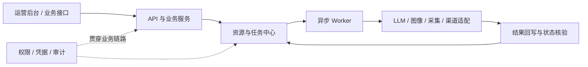

# 内容 AI 生产运营平台：设计与改进

## 1. 项目背景

该项目是一套服务于真实内容业务的 AI 生产运营平台，用于管理内容采集、资源治理、AI 加工、任务调度、多角色协作和多渠道发布。系统需要同时处理多种内容形态，并接入大语言模型、文生图、工作流服务和不同业务渠道。

项目要解决的核心问题不是简单地调用一次模型，而是把具有不确定性的外部能力变成可运营的生产能力：模型可能超时、返回错误格式或临时不可用；生成任务可能持续数分钟；不同渠道的数据结构和接口规则并不一致；运营、审核及协作人员还具有不同的数据可见范围。

因此，平台以内容资源和任务为核心，通过统一接口、异步状态机、权限边界、质量治理、失败恢复和调用审计连接整条业务链路。

公开仓库 `content-ai-engine` 是从完整系统中提取的脱敏参考实现。它保留了 LLM 网关、内容审核、标题加工、封面生成、结构化输出和批量处理等通用模式，使用 Mock 与合成输入提供可运行验证，不包含实际业务数据、渠道配置和完整生产基础设施。

## 2. 设计目标

系统主要围绕七个目标设计：

1. **异构内容可统一管理**：不同来源和形态的内容先进入统一资源模型，下游不直接依赖来源结构。
2. **长耗时任务不阻塞业务请求**：模型生成、采集和媒体处理通过异步任务执行，前端只查询明确的任务状态。
3. **AI 能力可配置和降级**：业务按用途请求能力，不在各处硬编码具体模型或供应商；单个服务异常时可以切换候选能力。
4. **模型输出可治理**：对生成结果执行约束、清洗、结构校验、重试和兜底，不把 LLM 输出直接当作可信数据。
5. **权限和凭据边界清晰**：资源可见范围在查询层统一执行，外部平台凭据集中管理并控制使用范围。
6. **流程可恢复、可审计**：任务失败后可以定位、重试或恢复，调用记录、状态变化和发布结果可以追踪。
7. **研发过程可由 AI 加速**：使用 AI 完成需求拆解、PRD、原型、代码、测试和复盘，同时由人持续校正业务规则与技术方案。

系统没有把“完全无人参与”作为目标。业务边界、风险取舍、验收标准和上线判断由我负责，AI 用于提高产品设计与工程实现的速度。

### 2.1 竞品差异与自研边界

项目立项时面对的并不是“市场上没有 AI 平台”，而是现有产品各自解决了模型应用、流程自动化或营销内容生产中的一部分问题。竞品调研的目的不是证明所有能力都应该自研，而是确认哪些能力可以直接复用，哪些能力必须由系统掌握才能形成稳定的业务闭环。

下表开源项目的 Star 数量来自 GitHub 公开页面，只用于说明生态规模和市场关注度，不代表产品质量或企业落地效果；商业产品的数据采用厂商公开口径。

| 竞品 | 公开规模与主要能力 | 优势 | 与本项目需求的差异 |
|---|---|---|---|
| [Dify](https://github.com/langgenius/dify) | 约 15.5 万 GitHub Stars；覆盖工作流、RAG、Agent、模型管理和可观测性 | 通用 LLM 应用从原型到发布的链路成熟，模型和插件生态丰富 | 核心对象是 AI 应用和工作流；内容来源、资源审核、批量加工、多角色协作、渠道发布及远端状态回写仍需要结合业务另行建设 |
| [Coze Studio](https://github.com/coze-dev/coze-studio) | 约 2.16 万 GitHub Stars；支持 Agent、工作流、知识库、插件、数据库和应用发布 | 可视化程度高，适合快速搭建和验证 Agent 应用 | 更偏 Agent 开发平台；组织数据范围、长耗时媒体任务、批量内容状态和定制渠道规则不是本项目可以直接交给通用工作流表达的全部业务 |
| [n8n](https://github.com/n8n-io/n8n) | 约 20.4 万 GitHub Stars；官网列出 500+ 集成，支持可视化编排、自定义代码和自托管 | 跨系统连接能力强，适合触发、搬运和转换数据 | 它不了解内容审核、标题改写、封面生成、素材状态和发布回执等业务语义；把复杂状态全部放进流程节点，会增加权限复用、状态一致性和长期维护成本 |
| [Jasper](https://www.jasper.ai/brand) | 官方公开口径为 10 万+全球客户、累计生成 50 亿+词，并被近 20% 的《财富》500 强企业使用 | 品牌语调、营销内容生成、团队协作和企业治理成熟 | 面向标准化营销内容场景；企业已有的内容来源、内部资源模型、角色权限、审批规则和发布接口仍需要较深的系统集成 |
| [Adobe GenStudio for Performance Marketing](https://experienceleague.adobe.com/en/docs/genstudio-for-performance-marketing/user-guide/home) | 官方产品覆盖内容生成、资产管理、审核批准、渠道激活和效果分析 | 内容供应链完整，并能与 Adobe 创意和营销生态协同 | 业务方向最接近，但产品体系较重且依赖 Adobe 生态；对于已有系统和特定内容链路，接入成本、定制边界与平台绑定需要单独评估 |

调研形成了三个判断：

1. **通用模型接入和 Agent 编排已经有成熟方案**。Dify、Coze Studio 和 n8n 已经证明这类能力可以产品化，因此项目没有把重新开发一个低代码工作流编辑器作为目标。
2. **企业内容平台的竞争重点已经超出“能否生成”**。Jasper 和 Adobe GenStudio 更关注品牌一致性、资产管理、审核协作、渠道交付与效果反馈，这与项目从单次模型调用转向生产运营闭环的判断一致。
3. **没有单一产品可以不经改造覆盖现有业务**。直接采用通用 AI 平台，仍需建设资源中心、任务系统、权限体系和发布模块；直接采用内容 SaaS，也需要适配已有内容来源、组织规则和外部渠道。

#### 为什么选择自研一套业务平台

项目选择自研的主要原因不是追求技术栈完整，而是需要掌握几类不能分散在不同外部工具中的核心状态：一条内容从哪里进入、归属谁、经过哪些审核和加工、当前任务是否可恢复、使用了哪个模型、产生多少调用量、是否已经发布，以及远端平台是否真正接收成功。

如果直接以 Dify 或 Coze Studio 作为完整业务系统，Agent 和模型调用可以快速搭建，但内容资源、异步任务、组织权限和渠道发布仍要在外围开发；如果主要使用 n8n，系统集成会更快，但复杂业务状态可能散落在多个节点和执行记录中；Jasper 与 Adobe GenStudio 的内容运营能力更完整，但难以直接替代已有业务模型和定制接口。

因此，项目将“引入还是自研”的边界划分为：

| 选择 | 能力范围 | 判断依据 |
|---|---|---|
| 直接复用 | 大语言模型、文生图服务、对象存储、消息队列及外部渠道 API | 这些能力已有成熟供应商，项目通过统一接口和适配器使用，无需重新实现底层模型或基础设施 |
| 自主开发 | 内容资源模型、异步任务状态机、模型用途路由、输出质量链、组织权限、调用计量、失败恢复及渠道发布适配 | 这些能力承载业务状态、质量标准和数据边界，必须在同一系统中保持一致并可追踪 |
| 暂不建设 | 通用低代码 Agent 编辑器、基础模型训练、覆盖所有 SaaS 的连接器市场 | 与当前内容业务闭环关系较弱，投入会分散工程重点，也难以形成相对于成熟竞品的优势 |

自研的价值最终体现为：底层模型和供应商可以替换，而内容状态、质量规则、权限边界和生产记录仍由平台持续掌握。新增模型、内容来源或发布渠道时，通过配置或适配器接入，而不需要重新改写整条业务流程。

## 3. 从 AI 原型到生产系统

### 阶段一：使用 AI 完成原型和 PRD

项目从业务目标和使用场景出发。我先向 AI 说明用户角色、内容流转方式、主要页面和操作约束，让 AI 生成第一版产品原型与 PRD；随后通过多轮沟通调整信息架构、页面交互、字段含义、状态变化和异常场景，直到原型能够表达真实业务流程。

这个阶段不是把 AI 的第一次输出直接作为需求，而是通过可视化原型快速暴露遗漏。例如，一个按钮是否应该出现、列表中的数据范围如何计算、异步任务失败后用户看到什么，都能在写后端前被具体讨论。

经过确认的原型和 PRD 成为后续开发的共同输入，也减少了在代码阶段反复猜测业务意图的问题。

### 阶段二：通过 vibe coding 跑通最小业务闭环

我使用 vibe coding 的方式完成最初实现：把已确认的需求拆成小范围任务，让 AI 生成代码，在本地运行并查看真实结果，再把报错、行为偏差和新的边界条件反馈给 AI 继续修改。

最早的目标是跑通“内容进入系统 → AI 加工 → 结果写回 → 前端查看”的最小闭环。第一版采用单体后端和同步调用，开发速度快，适合验证产品方向，但长耗时生成会占用请求，外部服务异常也会直接影响页面。

这个阶段让我确认了一个原则：vibe coding 可以快速获得可运行版本，但生产可靠性必须通过状态设计、故障验证和代码边界逐步补齐，不能只依赖生成代码当时能够运行。

### 阶段三：用资源和任务定义稳定接口

随着采集来源、内容类型和加工动作增加，我将“资源”和“任务”设为两个核心对象：

- 资源记录内容本身、来源、归属、治理状态和扩展信息。
- 任务记录一次加工或执行的输入、状态、结果、错误和外部任务标识。

不同内容先归一为统一资源，再由任务驱动采集、审核、标题加工、封面生成、结构化创作和发布。业务模块通过资源 ID、任务 ID 与结构化输入输出协作，避免直接依赖彼此的内部实现。

### 阶段四：将同步执行改造成异步工作流

外部生成耗时从几秒到数分钟不等，同步等待会造成请求超时，进程退出后还可能丢失任务。因此系统将接口接收与实际执行解耦：API 负责校验并创建任务，Worker 负责调用外部服务、轮询结果和写回状态。

随后又根据任务特征拆分执行资源。浏览器采集、普通后台任务和 AI 生成具有不同的内存、网络和计算需求，分池后可以独立扩缩和隔离故障，避免一种任务挤占全部执行能力。

### 阶段五：把重复能力平台化

当多个业务都开始调用模型和渠道接口后，继续在各模块中单独实现会造成模型配置、错误处理、权限和审计口径不一致。于是系统逐步形成统一 LLM 网关、AI 生成任务状态机、内容治理层、组织权限层、采集适配层和渠道发布适配层。

平台化的判断标准不是“代码看起来更抽象”，而是新增一个模型、内容来源或发布渠道时，主要通过配置或新增适配器完成，已有业务流程无需整体改写。

### 阶段六：将研发经验沉淀为 Skills

我先带着 AI 完成一条真实功能，从需求拆解、PRD、原型、开发到测试持续沟通；效果满足要求后，再把稳定步骤整理为 Skills。Skill 在这里不是一段孤立提示词，而是 Agent 可读取的工作协议，包含触发条件、所需材料、执行步骤、检查清单和交付标准。

正式开工前，我会先单独准备和调试研发 Skill，而不是一边开发业务一边临时补规则。调试过程包括：

1. 为每个 Skill 定义职责边界，明确什么情况下触发、什么情况下应交给其他 Skill。
2. 准备完整输入、信息缺失输入和错误输入，观察 AI 是否会主动核对材料、标记假设或在必要时停止。
3. 使用一条小型真实需求完整跑通，检查输出是否能直接成为下一阶段的输入。
4. 根据偏差修改执行步骤、模板、示例和自检项，再重复测试。
5. 串联 PRD、原型、开发与测试，确认字段、页面、业务规则和验收标准能够前后追溯。

其中四个核心 Skill 的开工前准备重点如下：

| Skill | 开工前重点调试 | 稳定输出 |
|---|---|---|
| PRD 生成 | 信息完整性门禁、需求成熟度、假设标记、主流程与异常流程 | 可执行 PRD、范围、规则和验收标准 |
| 原型复刻 | 输入资料可信度、页面层级、组件状态、交互与异常场景 | 可供开发使用的原型说明和页面状态 |
| 开发实现 | 材料盘点、冲突裁决、需求与代码对齐、可运行性检查 | 与 PRD 和原型对应的前后端实现 |
| 前后端测试 | 测试模式、覆盖维度、工具实测、缺陷复现和回归门禁 | 测试矩阵、问题清单、复现步骤和验收结果 |

只有这条研发链在小范围任务上稳定后，才用于正式功能开发。后续发现的新问题继续转化为 Skill 规则、测试方法或文档，使 AI 的工作方式可以复用，而不是依赖某一次对话的上下文。

## 4. 总体架构

平台先把内容归入资源与任务中心，再由异步 Worker 调用模型、采集和渠道能力，最终把结果与远端状态写回。权限、凭据和审计作为横向能力贯穿主链路。外部服务通过适配层接入，因此替换模型或供应商时，上层业务流程不需要整体改写。

## 5. 关键技术决策

### 5.1 资源与任务作为第一公民

不同来源的内容先转换为统一资源结构，通用字段进入稳定列，类型特有信息保存在扩展字段中。审核、加工和发布只依赖资源模型，不直接依赖原始站点或上游报文。

长耗时或可重试的操作统一建模为任务。任务记录业务状态、外部标识、输入、输出和错误，使前端刷新、Worker 重启或第三方延迟都不会让执行过程凭空消失。

### 5.2 LLM 统一网关按用途选择能力

早期各模块直接指定模型，导致更换供应商需要改代码，不同场景也容易选错模型。系统后来把模型端点、能力类型、可用范围和候选关系数据化，业务只声明“审核”“标题”“结构化创作”等用途。

网关根据用途选择候选模型，并依次处理超时、错误响应和空结果；主候选失败时尝试备用能力，所有候选失败后返回可解释的聚合错误。调用结果同时记录使用的配置、耗时、用量和是否发生降级。

这种设计把供应商变化收敛在网关内，也让运营侧能够观察主模型是否频繁依赖降级。

### 5.3 异步生成采用可恢复状态机

生成任务从创建开始就持久化。提交外部服务、等待结果、下载产物、对象存储转存和资源回写分别推进明确状态，并通过外部任务标识关联远端结果。

多个触发入口不会各自实现一套状态判断，而是汇入统一的状态收敛逻辑。Worker 定时轮询、后台恢复任务和人工查询都使用同一套规则：明确失败才进入失败状态，暂时无法确认时保留可恢复状态；迟到的成功结果仍可以被系统接收。

### 5.4 采集按统一数据流和适配器组织

不同站点的页面结构和反爬方式不同，但采集后的业务处理相同。系统将采集拆成来源适配、统一内容模型、媒体转存和资源上报几个阶段。站点特有逻辑只存在于适配器，去重、权限、审计和入库规则由平台统一完成。

对于具有相同底层结构的来源，优先共享解析器，把域名、字段映射和登录态等易变信息放入配置。这降低了来源改版和镜像变化时的维护成本。

### 5.5 对 LLM 输出执行完整质量链

模型输出按照“约束 → 清洗 → 检测 → 结构校验 → 带反馈重试 → 兜底”的顺序处理：

- 审核类任务使用固定分类和结构化结果，并根据业务风险明确选择故障时放行还是阻断。
- 标题类任务去除元回复、格式标签和无效内容，重试仍不合格时保留原标题并记录原因。
- 分镜、大纲等结构化任务先容错解析，再按 schema 检查字段、类型和状态，不把“可以解析”误认为“业务可用”。
- 封面等多阶段任务在统一收敛点写回资源，避免前端、Worker 和恢复任务重复实现结果处理。

### 5.6 数据可见范围在查询层统一执行

平台使用组织树、角色权限和个人归属共同计算数据范围。列表、统计、任务和发布校验复用同一作用域，不依赖前端隐藏菜单来保护数据。

菜单和操作权限由后端返回，前端据此展示功能；真正的数据过滤和操作校验仍在服务端执行。这样可以避免某个统计接口或后台任务绕过列表页的权限规则。

### 5.7 渠道差异收敛在发布适配器

不同渠道的认证、字段、上传流程和状态含义并不一致。系统为每类渠道提供适配器，对内暴露统一的准备、提交、查询和同步接口。

高敏凭据集中加密保存，只允许凭据服务在授权链路中解密使用；前端和普通任务拿不到明文。写操作完成后必须回查远端结果，因为接口返回成功并不一定代表内容已经正确入库或处于可用状态。

### 5.8 AI 研发流程使用 Skills 固化

研发 Skill 将一条需求依次转化为 PRD、原型说明、实现任务和测试结果。每个阶段保留明确产物，下一阶段只基于已确认材料继续工作，减少长对话中需求丢失或 Agent 凭空补全。

每个 Skill 由主说明、模板、示例和检查材料组成。开工前先使用代表性小任务调试触发条件、输入要求、输出格式、停止条件和工具调用；串联测试通过后再固定版本并进入正式开发。

Skill 中定义了几类关键门禁：核心信息不足时先补材料；推定内容必须标出可信度；开发前建立需求与实现的对应关系；测试必须操作可用的真实界面、接口或代码，无法实测的内容必须明确标记。这样 Agent 既能持续执行，也不会为了完成任务而编造缺失事实。

## 6. 问题驱动的设计改进与质量门禁

平台的多数工程规则来自生产问题，再被转化为架构约束、自动检查或研发 Skill。

### 6.1 同步生成导致请求超时

**问题**：文生图等外部任务耗时较长，接口同步等待会占用请求，代理超时或进程退出后任务无法继续。

**方案**：API 只创建任务并立即返回，实际提交和轮询进入异步 Worker；前端使用任务 ID 查询进度。

**结果**：用户请求与外部服务耗时解耦，生成过程可查询、可恢复，也能独立扩展执行资源。

### 6.2 不同任务共享 Worker 导致相互拖累

**问题**：浏览器采集、AI 生成和普通后台任务对内存、网络、GPU 与执行时长的需求差异很大，混在同一队列时容易形成阻塞。

**方案**：按照负载特征拆分 Worker 池和队列，分别设置并发、资源和部署策略，同时监控积压情况。

**结果**：单类任务异常不会占满全部执行能力，各类任务可以独立扩缩。

### 6.3 模型硬编码造成能力错配和单点故障

**问题**：业务模块直接绑定具体模型，结构化任务可能误用对话模型，供应商故障也会使所有调用同时失败。

**方案**：建立按用途路由的统一网关，将模型配置、候选关系和使用范围从业务代码中移出，并提供失败降级与调用记录。

**结果**：更换模型不需要修改业务流程，不同任务能够选择合适能力，供应商抖动也有明确兜底路径。

### 6.4 模型返回内容可以解析但不能使用

**问题**：LLM 可能返回代码围栏、错误字段、尾随文字或看似合法但缺少业务必填项的 JSON。仅调用解析函数不足以保证结果可靠。

**方案**：先进行有限容错和清洗，再执行 schema 与业务规则校验；把具体错误反馈给模型重试，多次失败后进入白名单失败路径。

**结果**：不稳定的自然语言输出被转换为可验证的数据接口，错误不会静默进入后续任务。

### 6.5 审计和计数反过来阻塞主链路

**问题**：在每次模型调用中同步写审计与用量，会增加事务时间；高并发更新少量计数记录还会产生热点竞争。

**方案**：审计使用独立短事务并允许非关键失败；高频用量先在缓存中原子累计，再由单一批处理任务写回持久层。

**结果**：保留可观测性与计量能力，同时减少辅助功能对核心调用延迟的影响。

### 6.6 多个入口分别推进状态造成不一致

**问题**：前端查询、Worker 轮询、定时恢复和人工补查都可能获得外部结果。如果各自写状态和回写资源，容易重复计费、重复写入或产生互相冲突的状态。

**方案**：所有入口只负责触发查询，状态判断、产物转存和业务回写统一进入一个收敛点，并检查当前状态是否允许转换。

**结果**：同一结果只按一套规则处理，恢复路径与正常路径保持一致。

### 6.7 单条失败拖垮整批处理

**问题**：批量审核、改写或生成中，某条资源缺字段或模型失败时，如果使用全有或全无语义，会丢失其他已经完成的有效结果。

**方案**：每个条目独立返回 `ok`、`skipped` 或 `failed`，记录跳过及失败原因，并支持针对失败项重试。

**结果**：批量任务以“尽可能多成功、失败可见”为目标，不因单条异常浪费整批结果。

这些问题不会只记录在复盘文档中。能够确定判断的部分进入代码和测试，需要语义判断的部分进入 Skill 与检查清单，涉及架构边界的部分则成为后续模块必须遵守的约束。

## 7. AI 在项目中的使用方式

AI 贯穿了产品设计、工程实现和质量改进全过程：

- **Skill 准备与调试**：正式开工前先用小型真实需求验证 Skill 的触发、输入输出、停止条件和串联关系，稳定后再用于项目。
- **需求与产品设计**：根据业务目标生成需求拆解、PRD、页面原型和交互说明，再通过多轮反馈修正。
- **架构讨论**：比较同步与异步、状态推进、数据模型和模块边界等方案，帮助暴露遗漏场景。
- **vibe coding**：根据小范围任务生成代码，我在真实环境运行后把报错和行为偏差继续反馈给 AI，直到通过验收。
- **前后端实现**：辅助完成接口、页面、任务、适配器、数据迁移和工程脚本。
- **测试与审查**：根据状态、权限和异常路径生成测试矩阵，并操作真实接口或页面验证结果。
- **故障分析**：结合日志、调用链和运行状态定位问题，再将修复经验转化为自动检查或长期规则。
- **研发流程沉淀**：把已跑通的需求拆解、PRD、原型、实现和测试流程整理为可复用 Skills。

实际协作采用“目标与约束 → AI 初稿 → 真实运行 → 具体反馈 → 局部修正 → 验证固化”的循环。第一版代码只是讨论起点，是否进入系统取决于真实运行结果、业务边界和回归验证。

我的工作集中在业务建模、架构取舍、风险判断、验收标准、生产问题复盘和最终决策。AI 扩大了我设计、编码和验证的速度，但无法替代对真实业务、外部系统和生产结果负责的人。

这套方式的关键不是让 AI 一次写完整个系统，而是把复杂项目拆成 AI 能处理、程序能验证、人能判断的阶段，并把每次成功和失败都沉淀为下一次可复用的外部记忆。

## 8. 验证方式

平台通过多层验证确认功能与架构行为。

### Skill 与研发链路验证

- 使用应触发和不应触发的请求检查每个 Skill 的职责边界，避免多个 Skill 抢同一任务。
- 分别使用完整、缺失和冲突材料，验证 AI 会继续执行、标记假设还是停止补充信息。
- 用小型真实需求串联 PRD、原型、开发和测试，检查上一阶段产物能否直接被下一阶段消费。
- 检查需求、页面、业务规则、代码位置和测试用例之间是否可以追溯，避免开发范围在传递中发生变化。
- 确认测试 Skill 实际调用可用工具；未运行的检查必须明确标记，不能用推理结果代替实测。

### 需求与原型验证

- 根据角色和业务场景逐条走查页面流程，而不是只检查页面是否完成。
- 对状态变化、权限差异、空数据、失败提示和恢复入口进行交互验证。
- 原型确认后再进入开发，需求变化同步更新结构化产物。

### 代码与接口验证

- 单元测试覆盖解析、清洗、状态转换和权限判断等确定性逻辑。
- 冒烟测试验证模型网关、审核、标题、封面、结构化输出和批量语义的完整链路。
- 关键写接口使用真实请求验证，并在操作后回查数据或远端状态。
- 对 API、Worker 和外部服务之间的输入输出执行 schema 与边界检查。

### 故障与恢复验证

- 主动模拟模型超时、错误格式、空响应、任务迟到和单条失败。
- 验证候选降级、有限重试、任务恢复及批量部分成功语义。
- 检查重复投递和重复查询不会造成重复生成、重复计量或重复回写。
- 观察队列积压、调用日志、状态停留时间和错误分布，确认问题可定位。

### 权限与安全验证

- 使用不同组织和角色检查列表、统计、任务和发布操作的数据范围。
- 验证前端不可见功能在直接调用接口时仍会被服务端拒绝。
- 检查敏感字段不会通过列表、日志、异常或接口响应返回明文。
- 凭据、模型配置和高风险操作保留必要的访问与变更记录。

### 部署与交付验证

- 在目标运行环境执行依赖安装、数据库迁移、模块导入和健康检查。
- 核对 Worker 实际消费的队列、任务状态以及外部依赖连通性。
- 发布或生成操作完成后回读真实业务结果，不以单次成功响应作为最终结论。
- 每次生产问题修复后补充针对性测试或检查规则，防止同类问题再次发生。
